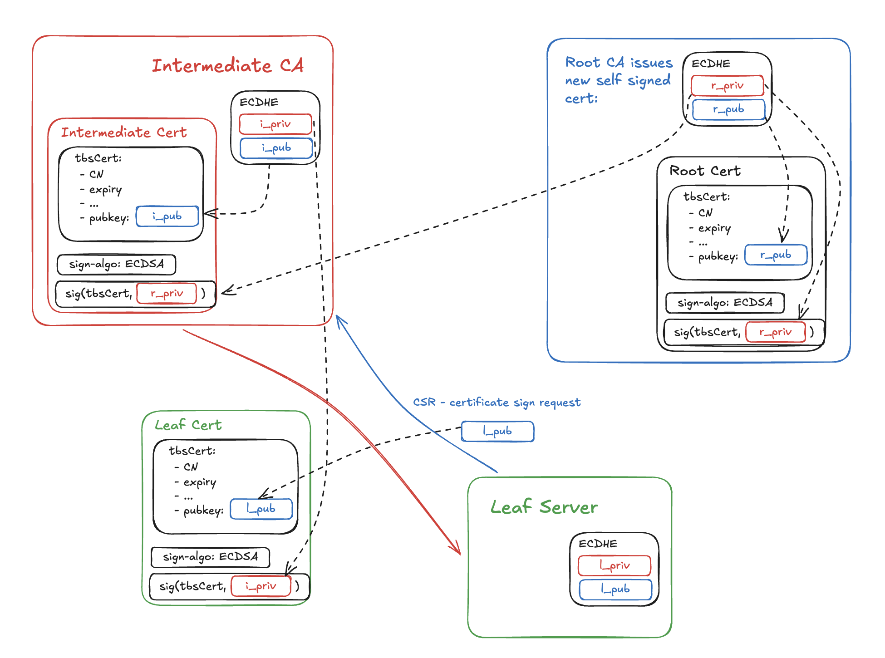
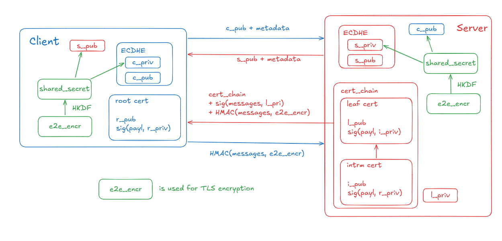

# TLS Handshake & Certificate Chain

## Tags
#networking #tls #security #https #backend

---

## Overview

- TLS (Transport Layer Security) adds confidentiality, integrity, and authentication on top of TCP
- TCP provides reliable delivery but in plaintext with no identity verification
- TLS sits between TCP and HTTP — negotiated after TCP handshake, before any HTTP data flows
- Three guarantees: **Confidentiality** (encryption), **Integrity** (tamper detection), **Authentication** (identity verification)

---

## What TCP Does Not Provide

| Guarantee | TCP | TLS |
|---|---|---|
| Reliable delivery | ✓ | — |
| Ordered delivery | ✓ | — |
| Confidentiality | ✗ | ✓ (AES-GCM) |
| Integrity | ✗ | ✓ (AEAD MAC) |
| Authentication | ✗ | ✓ (certificates) |
| Forward secrecy | ✗ | ✓ (ECDHE) |

---

## The Core Problem TLS Solves

Without authentication, encryption is useless. A MITM attacker can intercept your TCP connection and present their own certificate claiming to be `api.example.com`. You'd be encrypting traffic directly to the attacker.

TLS solves this with a **web of trust** — Certificate Authorities (CAs) that are pre-trusted by operating systems and browsers.

---

## Certificate Authority Trust Model

### Root of Trust
~150 trusted root CAs pre-installed in OS/browser trust stores (maintained by Mozilla, Apple, Microsoft, Google). If a CA signs a certificate, and you trust the CA, you trust the certificate.

### Why Intermediate CAs Exist
```
Root CA (offline, HSM-protected)
    ↓ signs
Intermediate CA (online, day-to-day signing)
    ↓ signs
End-Entity Certificate (api.example.com)
```


Root CA private keys are kept **offline** in Hardware Security Modules in physically secured facilities. If an intermediate CA is compromised, it can be revoked without touching the root. Compartmentalization of risk.

---

## What's Inside a Certificate

```
Subject:          api.example.com
Issuer:           DigiCert Intermediate CA
Valid From:       2026-01-01
Valid Until:      2027-01-01
Public Key:       <server RSA/EC public key>
SANs:             api.example.com, *.example.com
Serial Number:    abc123
Signature:        <issuer's signature over all fields above>
```

**Subject Alternative Names (SANs)** — actual list of domains the cert covers. Wildcard `*.example.com` covers all direct subdomains.

**The signature is the trust anchor** — CA signed this cert with its private key; anyone with CA's public key (from trust store) can verify it.

---

## Certificate Verification Steps (Client)

When browser receives server's certificate during TLS handshake:

```
1. Build chain: end-entity → intermediate → root (from local trust store)
2. Verify each signature cryptographically
3. Check validity period (not before / not after)
4. Check domain: does Subject or SAN match the requested hostname?
5. Check revocation status (CRL, OCSP, or OCSP Stapling)
6. All pass → extract server public key → proceed with key exchange
```

**Step 4 prevents**: certificate issued for `evil.com` being used for `api.example.com`

---

## Certificate Revocation

### CRL (Certificate Revocation List)
- CA publishes list of revoked serial numbers
- Client downloads and checks
- Problem: CRLs grow large; can become stale between updates

### OCSP (Online Certificate Status Protocol)
- Client queries CA's OCSP server in real time: "is cert #abc123 valid?"
- Problem: adds latency to every TLS handshake; privacy leak (CA learns which sites you visit); OCSP server downtime can block TLS entirely

### OCSP Stapling (Production Solution)
- **Server** queries OCSP, attaches signed CA response to TLS handshake
- Client gets revocation proof without contacting CA
- Eliminates latency, eliminates privacy concern, eliminates CA availability dependency

---

## TLS 1.3 Handshake

```
Client                                        Server
  |                                             |
  |──ClientHello──────────────────────────────> |
  |  TLS 1.3, cipher suites, client random,     |
  |  ECDHE key share                            |
  |                                             |
  | <───────────────────────────ServerHello──── |
  | <─────────────────────────────Certificate── |
  | <───────────────────────CertificateVerify── |
  | <───────────────────────────────Finished─── |
  |                                             |
  |──Finished──────────────────────────────────>|
  |                                             |
  |══════════ Encrypted HTTP begins ════════════|
```


* **ClientHello**: the client generates ECDHE keys `c_priv` and `c_pub` and sends `c_pub` along with supported ciphers, curves, nonce, etc.
* **ServerHello**: the server generates ECDHE keys `s_priv` and `s_pub`, and sends the chosen cipher, nonce, etc.
* Client and Server compute `shared_secret` using the ECDHE algorithm. `Server’s shared = ECDHE(s_priv, c_pub), Client’s shared = ECDHE(c_priv, s_pub)`.
* From `shared_secret` they derive, using the `HKDF` function, a bunch of keys that are going to be used for the actual encryption.
* **Certificate**: the Server sends its certificate to the client.
* **CertificateVerify**: the Server sends a hash over all the previous TLS messages along with a signature created from the Leaf’s private key.
* **ServerFinished**: the Server computes the final e2e encryption key along with an HMAC over all the messages sent to the client so far.
* Client validates the certificate chain (leaf -> intermediate -> root).
* Client validates the leaf certificate from the CertificateVerify message and the Leaf cert’s public key.
* **ClientFinished**: the Client verifies the HMAC from the Finished message matches the one it calculated from all the messages it received, and sends its own HMAC to the server.
* Server validates the client’s Finished HMAC.
The beauty of this method is that everything happens over an open network, and any middleman can sit there and see the communication but can’t do anything about it. Besides that, the generated encryption keys, as well as the `shared_secret`, are only for the current TLS session. Even if they are compromised, the malicious actor can only decrypt a single session’s messages.

**Total: 1 RTT** (TLS 1.2 = 2 RTTs)

### Key Exchange — ECDHE (Elliptic Curve Diffie-Hellman Ephemeral)

Both sides exchange public keys. Each independently computes the same shared secret using their private key + other side's public key. Shared secret never transmitted — eavesdropper sees only public keys and cannot derive the secret (DH mathematical guarantee).

From shared secret, both derive:
- Symmetric session key (AES-GCM typically) for encryption
- MAC key for integrity verification

### CertificateVerify
Server signs the **entire handshake transcript** with its private key. Client verifies using public key from certificate. This proves server **possesses** the private key — not just that it has a copy of the cert.

---

## Why Symmetric Keys After Asymmetric Negotiation

Asymmetric encryption (RSA, ECDH) is computationally expensive — impractical for bulk data encryption. Use asymmetric once to establish a shared secret, then switch to fast symmetric encryption (AES-GCM) for all data. Best of both worlds.

---

## Forward Secrecy

**ECDHE uses ephemeral key pairs** — new pair generated per session, discarded after. Even if server's long-term private key is compromised years later, past session keys cannot be derived.

**Without forward secrecy (RSA key exchange)**: attacker records encrypted traffic today, steals private key later, decrypts all historical sessions. ECDHE prevents this.

---

## TLS 1.2 vs TLS 1.3

| Feature | TLS 1.2 | TLS 1.3 |
|---|---|---|
| Handshake RTTs | 2 | 1 |
| Cipher suites | Many (some weak) | Only strong ones |
| Forward secrecy | Optional | Mandatory (ECDHE only) |
| 0-RTT | No | Yes (repeat connections) |
| RSA key exchange | Supported | Removed |

TLS 1.2 allowed RSA key exchange (no forward secrecy). TLS 1.3 mandates ECDHE — forward secrecy is non-negotiable.

---

## Certificate Types

| Type | Validation | Time | Trust Level |
|---|---|---|---|
| DV (Domain Validation) | Domain control only | Seconds (ACME/Let's Encrypt) | Domain ownership |
| OV (Organization Validation) | Org existence verified | Days | Legal entity |
| EV (Extended Validation) | Strict org verification | Weeks | Deprecated in browsers |

**Let's Encrypt**: free, automated, 90-day DV certs via ACME protocol. 90-day expiry forces automation and limits compromise window. No reason for paid DV certs for most use cases.

---

## Failure Scenarios

- **Expired certificate** — browser shows hard error; automated renewal (certbot) failure causes outage
- **Domain mismatch** — cert issued for `example.com` used for `api.example.com` (not in SANs) → rejected
- **Intermediate cert not served** — server sends only leaf cert; clients without cached intermediate fail to build chain
- **Private key compromise without forward secrecy** — all historical sessions decryptable (reason TLS 1.3 mandates ECDHE)
- **CA compromise** — attacker gets CA to issue fraudulent cert for your domain; Certificate Transparency logs catch this
- **OCSP server down** — without stapling, TLS handshakes may fail or degrade; stapling eliminates this dependency

---

## Certificate Transparency (CT)

All publicly trusted CAs must log issued certificates to public CT logs. Browsers verify certificates appear in CT logs. Domain owners can monitor CT logs for unauthorized certificates issued for their domain — misissuance detection.

---

## Real-World Usage

- Let's Encrypt: ~300M active certificates; dominates DV market
- OCSP Stapling: enabled by default in nginx, caddy; must be explicitly configured in some setups
- TLS 1.3: mandatory in modern production; TLS 1.2 kept for legacy client compatibility
- Certificate pinning: mobile apps pin specific cert/public key — prevents MITM even with compromised CA; brittle (pin rotation is operational risk)

---

## Interview Perspective

- Walk through TLS 1.3 handshake step by step — interviewers frequently ask this
- Explain why asymmetric key exchange switches to symmetric encryption
- Know forward secrecy: what it is, why ECDHE provides it, what RSA key exchange lacks
- Certificate chain: know the three levels and why intermediates exist
- Be able to explain what CertificateVerify proves and why it matters

---

## Revision Summary

- TLS adds: confidentiality (AES-GCM), integrity (AEAD), authentication (certificates)
- Trust chain: Root CA (offline) → Intermediate CA → End-entity cert
- Certificate verification: chain build → signature verify → expiry → domain match → revocation
- TLS 1.3 handshake = 1 RTT; TLS 1.2 = 2 RTTs
- ECDHE: ephemeral keys, shared secret never transmitted, provides forward secrecy
- CertificateVerify: server signs handshake transcript proving private key possession
- Forward secrecy: ephemeral keys mean past sessions safe even if long-term key compromised
- OCSP Stapling: server attaches revocation proof — eliminates latency and CA dependency
- Let's Encrypt: free, 90-day, automated DV certs via ACME

---

## Active Recall Questions

1. What three guarantees does TLS add that TCP does not provide?
2. Why do intermediate CAs exist? Why not have root CAs sign everything?
3. Walk through the TLS 1.3 handshake step by step
4. Why does ECDHE key exchange switch to symmetric encryption for data?
5. What is forward secrecy? Why does ECDHE provide it but RSA key exchange does not?
6. What does CertificateVerify prove? Why is it needed?
7. What is OCSP Stapling and what problem does it solve over basic OCSP?
8. What happens if a server sends only its leaf certificate without the intermediate?

---

## Related Concepts

- [[HTTPS Request Lifecycle]]
- [[HSTS]]
- [[HTTP Version Evolution]]
- [[HTTP Authentication — Cookies & Sessions]]
- [[TCP Three-Way Handshake]]
